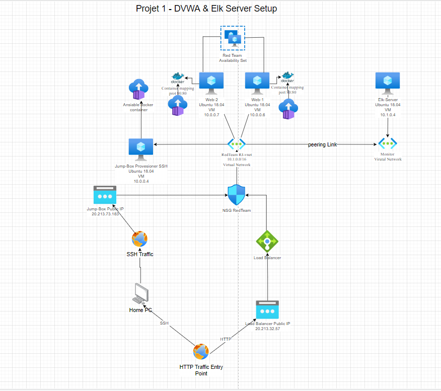
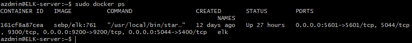
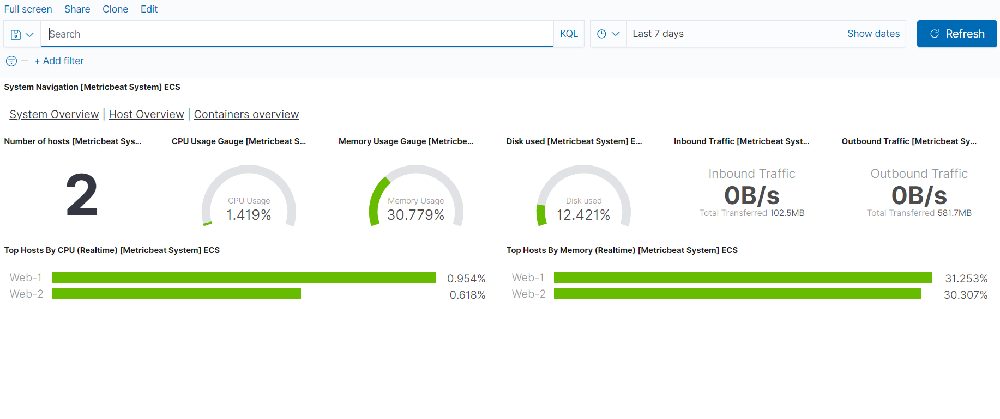
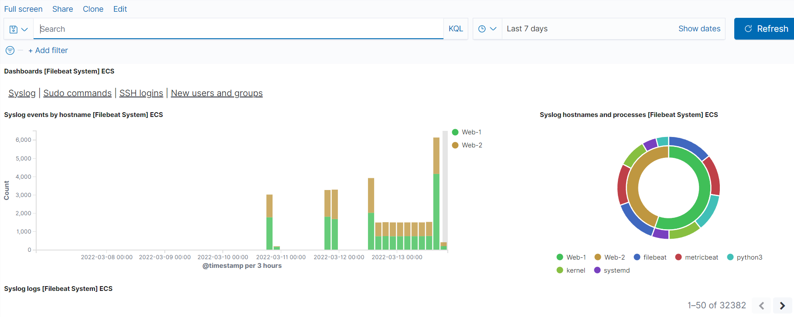

# Homework13
Week 13
Project Information
what was required by the course as further proof of understanding and sharing of skills.

The network design below contains a intentionally vulnerable web application D*mm Vulnerable Web Application or DVWA and uses modern tools such as Elk for monitoring.

This design also contains elements of Docker, Ansible and Azure cloud services, including the use of High Availability (HA) technologies.

# Introduction

These files have been tested and used to generate a live ELK deployment on Azure. They can be used to either recreate the entire deployment pictured above. Alternatively, select portions of the Ansible file may be used to install only certain pieces of it, such as Filebeat.

This project also contains the following details:

- Network Design Topology
- Access Control Policies
- ELK Configuration, including Configuration of monitoring software below
    - MetricBeat Setup
    - FileBeat Setup
- Use of Ansible for Automated Deployment.


# Network Design

The following design below is a representation of an Azure Cloud setup of the Elk stack, including the setup of a Load Balancer and use of network security groups to limit the flow of traffic using rule based control.

In this design, all traffic was restricted to each of our personal IPv4 public IP addresses.




Network Design

# Resources

## Virtual Machines

- x4 Ubuntu based machines (tested using Ubuntu Server LTS 20.04)
- x1 client workstation, or a device capable of displaying a browser.

## Networking Requirements

- NAT  or Bridged Network
- Traefik Reverse Proxy for HTTP traffic (or a Azure Load Balancer and NSG rule)

## Virtual Machine Specifications

- x1 VM with 2vCPUs and at least 4Gb Memory.
- x2 VMs with 2vCPUs and 2Gbs Memory
- x1 VM with 1vCPU and 2Gbs Memory

*Knowledge and Skills*  This project is designed to help new cyber security professionals log and monitor internal systems, including. the below are assumed skills

- Intermediate Linux directory navigation and diagnostic skills.
- Understanding of virtualization software and technologies, such as containerization and hypervisors
**Network Access Policies** The machines on the internal network (vNet) are not exposed to the public Internet.

Using the diagram above and the table below, the only allowed port will be SSH for external access, this is additionally secured using a SSH key for an extra layer of security.

## Network Addresses

The below table contains the IP address information for each virtual machine, including its function and operating system.

| name      | function                                   | IP address | operating system |
|-----------|--------------------------------------------|------------|------------------|
| web1      | DVWA with fileBeat & metricBeat monitoring | 10.0.0.6   | Ubuntu 18.04     |
| web2      | DVWA with FileBeat & metricBeat Monitoring | 10.0.0.7   | Ubuntu 18.04     |
| Elk stack | Elk Stack Monitoring Host                  | 10.1.0.4   | Ubuntu 18.04     |
| Jump-Box  | Ansible configuration host                 | 10.0.0.5   | Ubuntu 18.04     || 


## Firewall Rules

*Public NSG Rules*

| name       | Public Traffic Allowed | Allowed IP Address |
|------------|------------------------|--------------------|
| Jump Host  | Yes (SSH)              | 20.213...(Home IP Addresses)    |
| Elk Server | Yes (port 5601)        | 20.70... (Home IP Addresses)    |


*Internal NSG Rules*

The below rules are allowed internal traffic.

| name      | Allowed IP Addresses            | Allowed Ports |
|-----------|---------------------------------|---------------|
| Web-1     | 10.0.0.4, 10.0.0.10 (Jump Host) | SSH           |
| Web-2     | 10.0.0.4, 10.0.0.10 (Jump Host) | SSH           |
| Elk Stack | 10.1.0.4 (Jump Host)            | 5601          |
| Jump Host |                                 | SSH           |


## Docker Containers

The following screenshot displays the result of running docker ps after successfully configuring the ELK instance.

Host: Webservers
```
root@a8bdb5a056a4:~# ansible webservers -a "sudo docker ps"
10.0.0.7 | CHANGED | rc=0 >>
CONTAINER ID   IMAGE                 COMMAND      CREATED       STATUS              PORTS                NAMES
5c4f50e5bb51   cyberxsecurity/dvwa   "/main.sh"   3 weeks ago   Up About a minute   0.0.0.0:80->80/tcp   dvwa
10.0.0.6 | CHANGED | rc=0 >>
CONTAINER ID   IMAGE                 COMMAND      CREATED       STATUS              PORTS                NAMES
ae29ee9b3c31   cyberxsecurity/dvwa   "/main.sh"   3 weeks ago   Up About a minute   0.0.0.0:80->80/tcp   dvwa
```

Host: Elk
```
azdmin@ELK-server:~$ sudo docker ps
CONTAINER ID   IMAGE          COMMAND                  CREATED       STATUS          PORTS                                                                                        NAMES
161cf8a87cea   sebp/elk:761   "/usr/local/bin/star…"   2 weeks ago   Up 11 minutes   0.0.0.0:5601->5601/tcp, 5044/tcp, 9300/tcp, 0.0.0.0:9200->9200/tcp, 0.0.0.0:5044->5400/tcp   elk
```
Target Machines & Beats

This ELK server is configured to monitor the following machines:

- 10.0.0.6
- 10.0.0.7

We have installed the following Beats on these machines:

- FileBeat - Syslog monitoring
- MetricBeat - System Resource monitoring

Filebeat monitors the log files or locations that you specify, collects log events, and forwards them either to Elk for monitoring and even history.

Metricbeat takes the metrics and statistics that it collects and ships them to Elk for further processing, this can be used for historical logs.

when used in conjunction with each other, this is a powerful monitoring tool for any Security operations center.

Using the Playbook

## Ansible Setup

In this project, all configuration was performed using Ansible scripts in the *Ansible* folder above. This is also secured by using SSH keys for each of the host machines on the virtual network.

use ssh-keygen to create a new SSH public key then cat .ssh/id_rsa.pub to get the key content. Modify the sshd file and disable password based authentication.

Ansible is used to automate deployments of network infrastructure and applications, it has various applications and use cases.

For this project the steps are as follows

1. Create an SSH Key on your home machine with **ssh-keygen**
2. Create 4 New Virtual Machine with Ubuntu (Web-1, 2, Elk Stack and Jump Host) 2.1. Create a availability set for both web machines to allow for additional redundancy.
3. Connect both Web virtual machines to the same virtual network (vNet)
4. Connect Jump Host to web network
5. Install Docker on Jump Host
6. Import cyberx/ansible docker container using **docker pull**
7. Start and access the Ansible container using **docker attach**
8. Setup an SSH key on the Ansible container to be imported on Web 1 and 2

## Elk Setup

Using the Ansible playbook, edit the Ansible host file and include your elk machine ip in the elk servers.

Provision the new docker container using the project1-elk-server.yml file and ansible-playbook <filepath>

The following screenshot displays the end result of running docker ps after successfully configuring the ELK instance.

Elk Docker PS Command
  

  
## Monitoring with MetricBeats and FileBeat

This ELK server is configured to monitor the following machines:

- 10.0.0.6
- 10.0.0.7

We have installed the following Beats on these machines:

- Web-1
- Web-2

Using the system module of Elk and MetricBeat. this has been configured to monitor for system events and record all logs from the **/var/log/** directory. this includes authentication events, CPU, memory and storage use.

you can find an example of the end result for MetricBeat here.




and FileBeat here.



to confirm Elk is running, navigate to *https://20.70.9.239:5601/app/kibana else use curl against the above address.